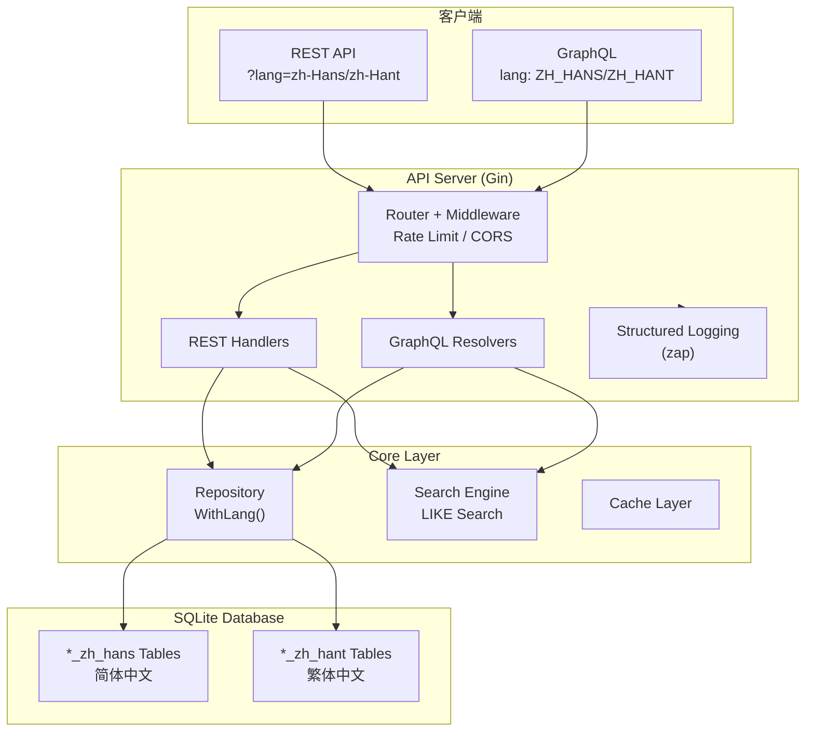

# Chinese Poetry API

<h2 align="center">
  
  <br>
  中国古诗词 API 服务
</h2>

[](https://hub.docker.com/r/palemoky/chinese-poetry-api)
[](https://hub.docker.com/r/palemoky/chinese-poetry-api)
[](https://goreportcard.com/report/github.com/palemoky/chinese-poetry-api)
[](https://github.com/palemoky/chinese-poetry-api/blob/main/go.mod)
[](https://github.com/pre-commit/pre-commit)
[](https://github.com/palemoky/chinese-poetry-api/blob/main/LICENSE)

基于 Go 语言的高性能中国古诗词 API 服务，支持 REST 和 GraphQL 接口，提供简体/繁体中文、爬虫练习场等功能。

## ✨ 特性

- 🚀 **高性能**: Go 语言编写，支持并发处理，性能优化（简繁转换 ~300ns/op）
- 📚 **海量数据**: 包含唐诗、宋词、元曲等近 40 万首诗词
- 🔍 **强大搜索**: 支持全文搜索、标题/内容/作者分类搜索
- 🌏 **双语支持**: 同一数据库同时存储简体和繁体中文，通过 `?lang=` 参数切换
- 🎯 **多种接口**: REST API 和 GraphQL 双接口支持
- 🛡️ **限流保护**: 内置 IP 限流，防止滥用
- 🐳 **容器化**: Docker 镜像开箱即用，支持多架构（amd64/arm64）
- 📊 **智能分类**: 按朝代、作者、诗词类型自动分类
- 📝 **结构化日志**: 使用 zap 高性能日志库
- ✅ **高质量代码**: 完整的单元测试、性能测试、模糊测试

## 🚀 快速开始

### 使用 Docker（推荐）

```bash
docker run -d -p 1279:1279 palemoky/chinese-poetry-api:latest
```

完整配置参见 [docker-compose.yml](docker-compose.yml)。

### 使用 Makefile

```bash
make help          # 查看所有可用命令
make build         # 构建项目
make process-data  # 处理数据
make run-server    # 启动服务
```

### 克隆仓库

本项目使用 Git Submodules 管理诗词数据，推荐使用以下命令快速克隆：

```bash
# 完整克隆（包含 submodules）
git clone --recurse-submodules --depth=1 https://github.com/palemoky/chinese-poetry-api.git
```

如果已经克隆了仓库，可以单独更新 submodules：

```bash
git submodule update --init
```

## 📡 API 使用

### 多语言支持

所有接口支持 `lang` 参数切换简繁体：

|  参数值   |       说明       |
| :-------: | :--------------: |
| `zh-Hans` | 简体中文（默认） |
| `zh-Hant` |     繁体中文     |

### REST API

```bash
# 简体中文（默认）
curl "http://localhost:1279/api/v1/poems"

# 繁体中文
curl "http://localhost:1279/api/v1/poems?lang=zh-Hant"

# 搜索诗词
curl "http://localhost:1279/api/v1/poems/search?q=静夜思"

# 随机诗词
curl "http://localhost:1279/api/v1/poems/random"

# 随机诗词（带过滤）
curl "http://localhost:1279/api/v1/poems/random?author=李白"
curl "http://localhost:1279/api/v1/poems/random?type=五言绝句"
curl "http://localhost:1279/api/v1/poems/random?author=李白&type=五言绝句"
curl "http://localhost:1279/api/v1/poems/random?author=李白&type=五言绝句&dynasty=唐"

# 作者列表
curl "http://localhost:1279/api/v1/authors?page=1&page_size=20"

# 朝代列表
curl "http://localhost:1279/api/v1/dynasties"
```

### GraphQL API

端点: `http://localhost:1279/graphql`

```graphql
# 繁体中文查询
query {
  poems(lang: ZH_HANT, pageSize: 10) {
    edges {
      node {
        title
        content
        author {
          name
        }
      }
    }
    totalCount
  }
}

# 搜索诗词
query {
  searchPoems(query: "静夜思", searchType: TITLE) {
    edges {
      node {
        title
        author {
          name
        }
      }
    }
  }
}

# 统计信息
query {
  statistics {
    totalPoems
    totalAuthors
    poemsByDynasty {
      dynasty {
        name
      }
      count
    }
  }
}
```

## 🔍 搜索功能

|   类型    |       说明       |             示例             |
| :-------: | :--------------: | :--------------------------: |
|   `all`   | 全文搜索（默认） |           `?q=月`            |
|  `title`  |     标题搜索     |    `?q=静夜思&type=title`    |
| `content` |     内容搜索     | `?q=床前明月光&type=content` |
| `author`  |     作者搜索     |    `?q=李白&type=author`     |

### ⚠️ 性能说明

**搜索端点性能特性**：

- 当前实现使用全表扫描（`LIKE` 查询）
- 在高性能设备上响应时间：~1 秒
- 在树莓派等低功耗设备上可能有明显延迟：
  - **Raspberry Pi 5**: ~5 秒
  - **Raspberry Pi 4**: ~10 秒
  - **Raspberry Pi 3B+**: 15-20 秒（实测）

**随机诗词端点**（`/api/v1/poems/random`）：

- 使用优化的 MAX(id) 算法
- 所有设备响应时间：<100ms ⚡
- 推荐作为主要使用方式

> 💡 **提示**: 如果您需要高性能搜索功能，欢迎提交 Issue。我们可以实施 FTS5 全文搜索优化，将搜索时间降低到 <100ms。

## 📖 数据集

本项目基于 [chinese-poetry](https://github.com/chinese-poetry/chinese-poetry) 数据集，包含:

|   分类   | 数量  |
| :------: | :---: |
| 五言绝句 | 18895 |
| 七言绝句 | 85032 |
| 五言律诗 | 71400 |
| 七言律诗 | 69028 |
|  乐府诗  | 9315  |
|  五代词  |  543  |
|   宋词   | 21369 |
|   元曲   | 10905 |
|   诗经   |  305  |
|   楚辞   |  65   |
|   论语   |  20   |
| 四书五经 |  14   |
|   其他   | 96232 |

## 🏗️ 系统架构



## 🙏 致谢

- 数据来源: [chinese-poetry](https://github.com/chinese-poetry/chinese-poetry)
- 简繁转换: [gocc](https://github.com/liuzl/gocc)

## 📮 联系方式

如有问题或建议，欢迎提交 [Issue](https://github.com/palemoky/chinese-poetry-api/issues) 或 [Pull Request](https://github.com/palemoky/chinese-poetry-api/pulls)。
